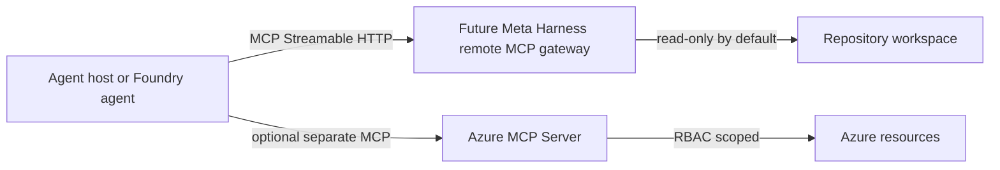

# Enterprise Remote MCP Sketch

This is a documentation-only deployment sketch. It is not an Azure provisioning script and does not prove that a remote Meta Harness MCP endpoint is deployed.

## Objective

Expose Meta Harness state to an enterprise agent host without weakening the protocol rule:

> No phase advances without verified evidence.

## Architecture

## Minimum Viable Remote Surface

Start with read-only tools only:

- `get_protocol_version`
- `get_harness_status`
- `get_current_phase`
- `get_ready_slices`
- `get_validation_plan`
- `get_checkpoint`
- `get_next_action`
- `render_template`

Do not enable `claim_slice`, `submit_slice_packet`, `record_command_output`, `write_checkpoint`, `request_write_lock`, `release_write_lock`, or `update_requirement_status` until a written policy authorizes checkpoint-write or workspace-write mode.

Treat remote `workspace-write` as not ready until the server has a dedicated remote authorization and write-scope model. The local `dangerous-disabled` mode is a no-danger compatibility marker, not an authentication or audit control.

## Azure Foundry Client Configuration Checklist

When Foundry Agent Service is the client:

1. Host Meta Harness as a remote MCP endpoint only after the Streamable HTTP gateway exists.
2. Store authentication in a Foundry project connection.
3. Prefer Microsoft Entra authentication or managed identity where possible.
4. Use OAuth identity passthrough only when per-user permissions must be preserved.
5. Set `allowed_tools` to read-only tools first.
6. Require approval for all write-capable tools.
7. Log approval decisions and sanitized tool-call arguments.
8. Validate one read-only tool call before expanding the allowlist.

## Azure Hosting Sketch

Azure Container Apps is the preferred first hosting sketch for a private remote MCP endpoint because Foundry documentation describes private MCP servers using internal-only ingress on a dedicated MCP subnet.

Do not provision this from Meta Harness by default. A future deployment plan must specify:

- container image build and provenance
- managed identity or Entra app registration
- private versus public ingress decision
- Origin validation policy
- request authentication and authorization middleware
- audit log destination
- secret redaction and retention settings
- rollback plan

Prefer the standalone Container Apps model for a custom Meta Harness MCP gateway. Do not use Container Apps dynamic sessions as the default Meta Harness path; that platform-managed MCP server exposes shell and Python execution tools and has a different risk profile.

## Azure MCP Server Separation

Azure MCP Server is a separate MCP server for Azure resource operations. It should have its own server label, RBAC scope, tool allowlist, and approval policy. RBAC limits what the identity can do, but it does not replace Meta Harness mutation policy or proof review.

Meta Harness should record Azure MCP output as external evidence only after the command or tool call actually runs. It must not convert Azure MCP output into `command_verified` or `runtime_verified` proof without parent review.

## Validation Without Provisioning

Phase 7 validation should use local commands only:

- docs build
- CI
- schema-check
- budget check
- package dry-runs
- production dependency audit
- checkpoint review

The expected proof status for this sketch is `static_verified` for documentation alignment and `not_verified` for live Azure deployment.
